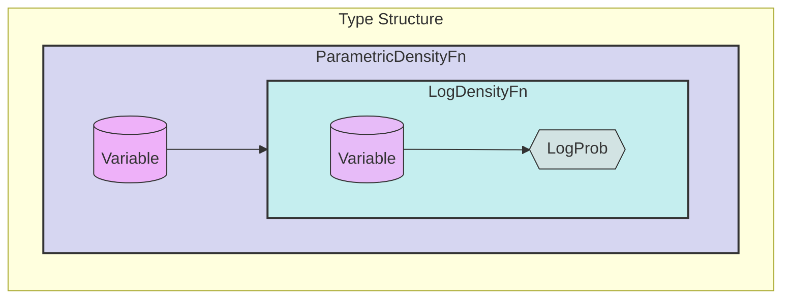
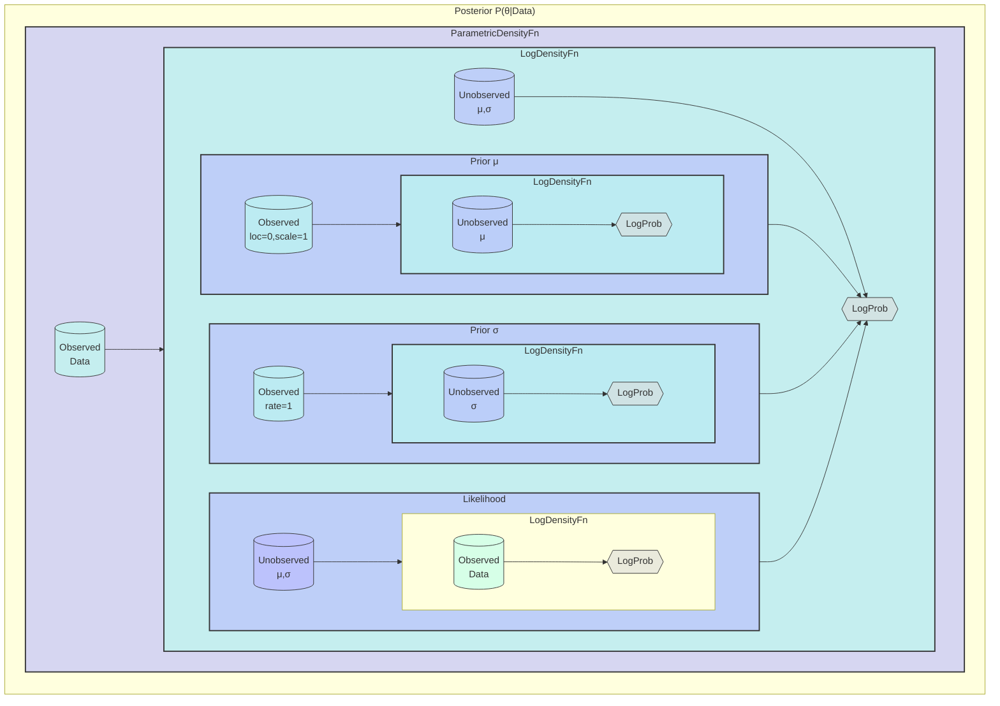
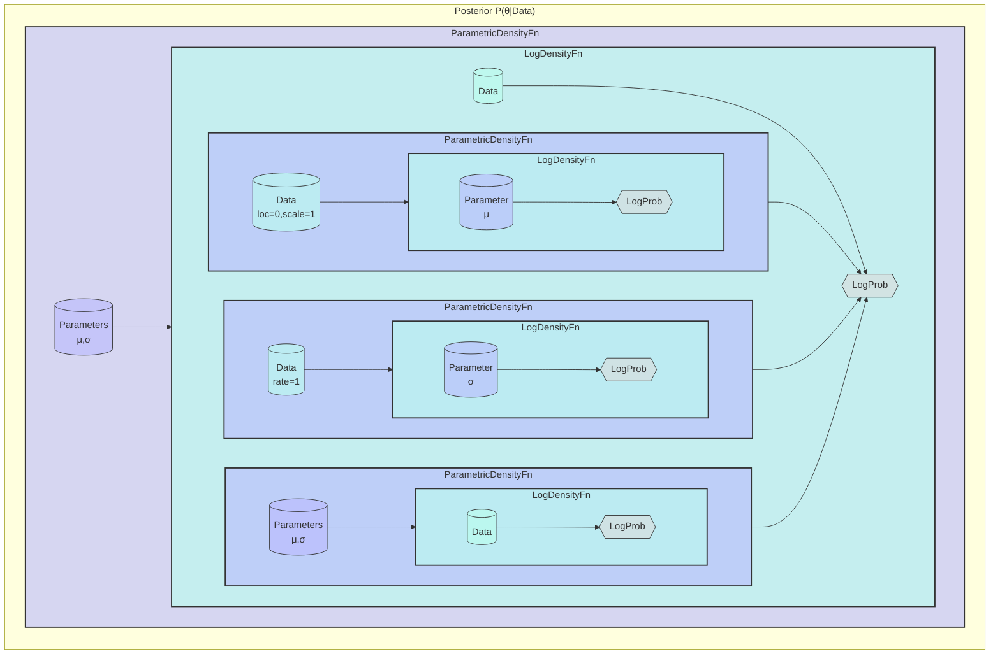

# Probabl



```mermaid
flowchart TD
    subgraph "Variable Types"
        direction TB
        V[("Variable")]
        OV[("Observed<br/>Data")]
        UV[("Unobserved<br/>Parameters")]
        V --> OV
        V --> UV
    end

    style V fill:#f9f9,stroke:#333
    style OV fill:#bfe9,stroke:#333
    style UV fill:#bbf9,stroke:#333
```mermaid

```mermaid
flowchart TD
    subgraph "Prior normal(0,1)"
        direction TB
        subgraph PDF ["ParametricDensityFn"]
            V[("Observed<br/>loc=0, scale=1")]
            subgraph LDF ["LogDensityFn"]
                V2[("Unobserved<br/>θ")] --> LP{{"LogProb"}}
            end
        end
        V --> LDF
    end

    style V fill:#bfe9,stroke:#333
    style V2 fill:#bbf9,stroke:#333
    style LP fill:#ddd9,stroke:#333
    style PDF fill:#bbf9,stroke:#333,stroke-width:2px
    style LDF fill:#bfe9,stroke:#333,stroke-width:2px
``

```mermaid
flowchart TD
    subgraph "Likelihood(θ,Data)"
        direction TB
        subgraph PDF ["ParametricDensityFn"]
            V[("Unobserved<br/>θ")]
            subgraph LDF ["LogDensityFn"]
                V2[("Observed<br/>Data")] --> LP{{"LogProb"}}
            end
        end
        V --> LDF
    end

    style V fill:#bbf9,stroke:#333
    style V2 fill:#bfe9,stroke:#333
    style LP fill:#ddd9,stroke:#333
    style PDF fill:#bbf9,stroke:#333,stroke-width:2px
    style LDF fill:#bfe9,stroke:#333,stroke-width:2px
```




