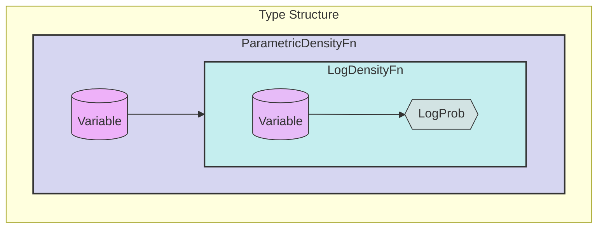

# Probabl

```mermaid
flowchart TD
    subgraph "Type Structure"
        direction TB
        subgraph PDF ["ParametricDensityFn"]
            V[("Variable")]
            subgraph LDF ["LogDensityFn"]
                V2[("Variable")] --> LP{{"LogProb"}}
            end
        end
        V --> LDF
    end

    style V fill:#f9f9,stroke:#333
    style V2 fill:#f9f9,stroke:#333
    style LP fill:#ddd9,stroke:#333
    style PDF fill:#bbf9,stroke:#333,stroke-width:2px
    style LDF fill:#bfe9,stroke:#333,stroke-width:2px
```
