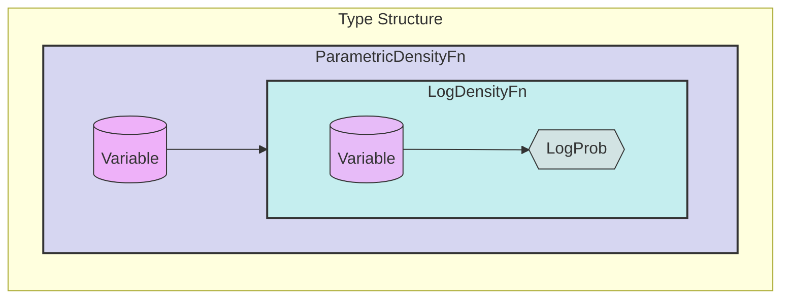
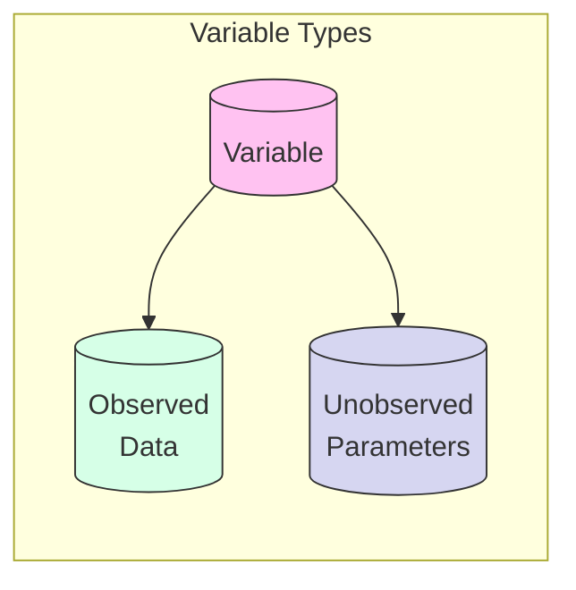
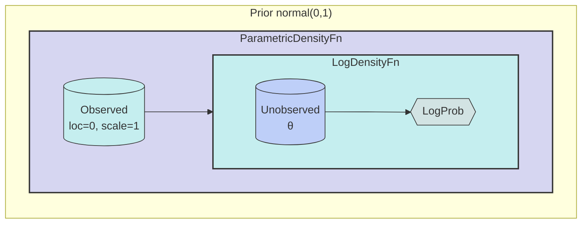
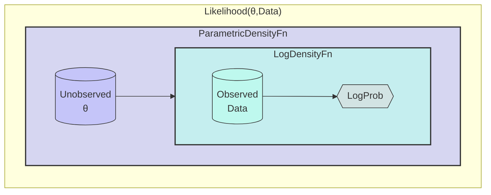
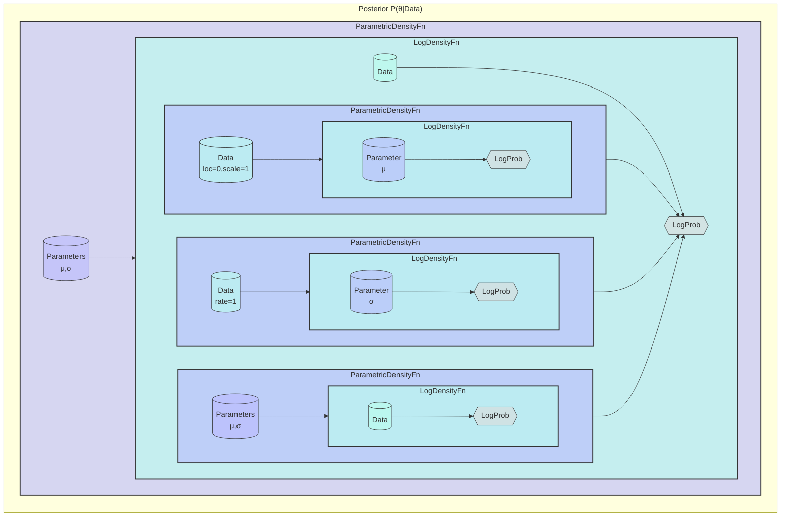

# Probabl

Key Concepts:
- A Variable can be either observed (data) or unobserved (parameters)
- ParametricDensityFn is a higher-order function that:
  - Takes a Variable as input
  - Returns a LogDensityFn
- LogDensityFn is a function that:
  - Takes another Variable as input
  - Returns a LogProb value
- This structure allows composition of probabilistic models where:
  - Priors follow: observed → (unobserved → LogProb)
  - Likelihoods follow: unobserved → (observed → LogProb)
  - Posteriors combine these patterns
- The same structure applies recursively to build complex models

Prior Example: normal(0,1)
- A prior distribution shows how hyperparameters determine parameter uncertainty:
- Observed hyperparameters: loc=0, scale=1 (fixed)
- Unobserved parameter: θ (to be estimated)
- The structure demonstrates:
- Outer function takes observed hyperparameters
- Inner function takes unobserved parameter θ
- Returns LogProb of θ under N(0,1)
- This follows the pattern:
  - observed → (unobserved → LogProb)
- Matches the general prior structure
- Shows how fixed values influence parameter uncertainty

